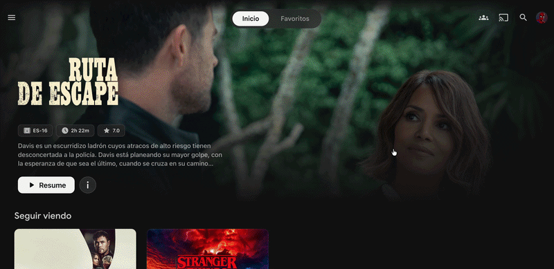

# Jellyfin Custom Rows — Platform Hub + Top 10 Trending

Custom JavaScript for Jellyfin that adds two sections to your home screen:

- **Platform Hub** — Clickable streaming platform cards (Netflix, Disney+, Apple TV+, Prime Video). Tap one to expand a scrollable row of all your content tagged with that platform.
- **Top 10 Trending** — Fetches trending movies and series from [Trakt.tv](https://trakt.tv) and cross-references them against your Jellyfin library. Only shows titles you actually own, ranked 1–10 with poster art, community ratings, and year.

Designed for the [Abyss theme](https://github.com/DesertCookie/jellyfin-abyss-theme) but works on any dark theme. Fully client-side — no plugins, no server-side changes.



---

## Features

- **Instant ID matching** — Builds a `Map` of TMDB/IMDB IDs from your entire catalog for O(1) lookups. No sequential API calls per trending item.
- **Fallback matching** — If provider IDs are missing, falls back to title + year comparison.
- **Responsive** — Grid layout on tablet, compact cards on mobile.
- **Lightweight** — Single IIFE, no dependencies, no build step.
- **MutationObserver injection** — Waits for the home screen DOM to be ready. No polling or intervals.

---

## Requirements

- Jellyfin **10.8+** (web client)
- A free [Trakt.tv API application](https://trakt.tv/oauth/applications/new) (you only need the Client ID)
- Content tagged by platform (for the Platform Hub section)

---

## Installation

### 1. Create a Trakt API app

Go to [trakt.tv/oauth/applications/new](https://trakt.tv/oauth/applications/new):

| Field | Value |
|---|---|
| Name | Anything (e.g. `Jellyfin Rows`) |
| Redirect URI | `urn:ietf:wg:oauth:2.0:oob` |

Save it and copy the **Client ID**.

### 2. Add the script to Jellyfin

This script integrates with the [Jellyfin-JavaScript-Injector plugin](https://github.com/n00bcodr/Jellyfin-JavaScript-Injector).

1. Install the JS Injector plugin following the instructions in its repository
2. Open your Jellyfin dashboard
3. Go to **Plugins** → **JavaScript Injector**
4. Add a new script and paste the contents of [`jellyfin-custom-rows.js`](jellyfin-custom-rows.js)
5. Replace `YOUR_TRAKT_CLIENT_ID_HERE` with your actual Client ID
6. Save

### 3. Tag your content (for Platform Hub)

The platform cards filter your library by Jellyfin tags. Add tags to your movies and series matching the platform they belong to:

| Platform | Tag |
|---|---|
| Apple TV+ | `Apple TV` |
| Disney+ | `Disney Plus` |
| Prime Video | `Amazon Prime Video` |
| Netflix | `Netflix` |

You can bulk-tag via **Edit Metadata → Tags** or use external tools.

### 4. Reload

Hard-refresh your browser (`Ctrl+Shift+R` / `Cmd+Shift+R`). The new rows will appear below the Spotlight section on your home screen.

---

## Configuration

### Adding or removing platforms and franchises

Edit the `STUDIOS` or `FRANCHISES` arrays at the top of the script. Each entry takes:

```javascript
{
    name: "HBO Max",              // Display name
    tag: "HBO",                   // Jellyfin tag to filter by
    gradient: "linear-gradient(135deg, #1a0a2e 0%, #0a0a0a 100%)",
    logo: "https://example.com/hbo-logo.png",
    invert: false,                // Optional: Set true if logo needs white inversion
    big: false                    // Optional: Set true for logos that require a larger size
}
```

### Changing the output order

The rows are injected in a specific order by default. To change this, locate the `injectUI` function at the bottom of the script and reorder the `wrapper.appendChild` lines to match your preference:

```javascript
function injectUI() {
    // ...
    const wrapper = document.createElement("div");
    wrapper.id = "custom-rows-wrapper";
    
    // REORDER THESE LINES TO CHANGE THE OUTPUT ORDER
    wrapper.appendChild(buildStudioSection());                 // Platforms
    wrapper.appendChild(buildTop10Section("Movies", "movie")); // Top 10 Movies
    wrapper.appendChild(buildTop10Section("Series", "tv"));    // Top 10 Series
    wrapper.appendChild(buildFranchiseSection());              // Franchises
    
    anchor.parentElement.insertBefore(wrapper, anchor.nextSibling);
}
```

### Adjusting trending count

The script fetches 50 trending items from Trakt and displays up to 10 matches. Change the `limit=50` parameter in the Trakt fetch URL and the `results.length >= 10` condition to adjust.

### Theming

CSS uses neutral dark tones with subtle glass effects. If you're on a different theme, you may want to tweak `border-radius`, `backdrop-filter`, or color values in the `injectCSS` function.

---

## How it works

```
Trakt.tv API ──► Trending list (50 items)
                        │
                        ▼
Jellyfin API ──► Full catalog ──► Map<TMDB_ID|IMDB_ID, Item>
                                         │
                                         ▼
                                  Cross-reference
                                         │
                                         ▼
                              Top 10 matched items
                              rendered on home screen
```

1. Fetches the trending list from Trakt's public API (no OAuth needed, just the Client ID).
2. Loads your full Jellyfin catalog for movies or series in a single API call.
3. Indexes all items by their TMDB and IMDB provider IDs into a `Map`.
4. Iterates through trending items and looks up each one in the map — O(1) per item.
5. If no ID match is found, falls back to exact title + year (±1 year tolerance).
6. Renders the first 10 matches with Jellyfin poster art and metadata.

---

## FAQ

**The Top 10 says "No matches found"**
This means none of the current trending titles exist in your library. The script only shows what you have — it doesn't add content.

**Platform cards don't expand when clicked**
Your content isn't tagged yet. Open a movie → Edit Metadata → Tags → add the platform name (e.g., `Netflix`). Must match exactly.

**Does this work on Jellyfin apps (Android/iOS/TV)?**
No. Custom JavaScript only runs in the web client.

**Is my Trakt Client ID a secret?**
No. The Client ID is a public identifier (like an OAuth `client_id`). It only grants read access to public endpoints. Your Trakt account is not exposed.

**Can I use this without Trakt?**
Yes — just remove the two `buildTop10Section` lines near the bottom of the script. The Platform Hub will still work independently.

---

## License

MIT
